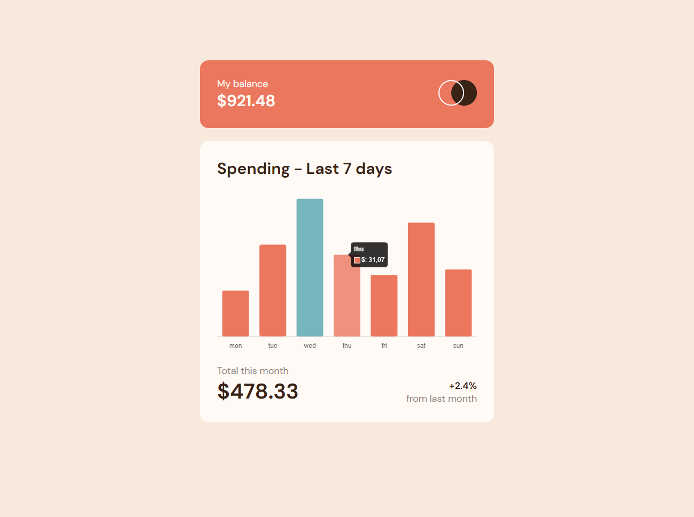

## Welcome! 👋

Thanks for checking out this front-end coding challenge.

This is a solution to the [Expenses chart component challenge on Frontend Mentor](https://www.frontendmentor.io/challenges/expenses-chart-component-e7yJBUdjwt). Frontend Mentor challenges help you improve your coding skills by building realistic projects.

### The challenge

Users can:

- View the bar chart and hover over the individual bars to see the correct amounts for each day
- See the current day’s bar highlighted in a different colour to the other bars
- View the optimal layout for the content depending on their device’s screen size
- See hover states for all interactive elements on the page
- See dynamically generated bars based on the data provided in the local JSON file

### Screenshot

### Links

- Solution URL: [Code](https://github.com/alesamv/Expenses-Chart-Component-built-with-Chart-JS)
- Live Site URL: [Web page]( https://alesamv.github.io/Expenses-Chart-Component-built-with-Chart-JS/)

## My process

### Built with

- Semantic HTML5 markup
- CSS custom properties
- Flexbox
- Mobile-first workflow
